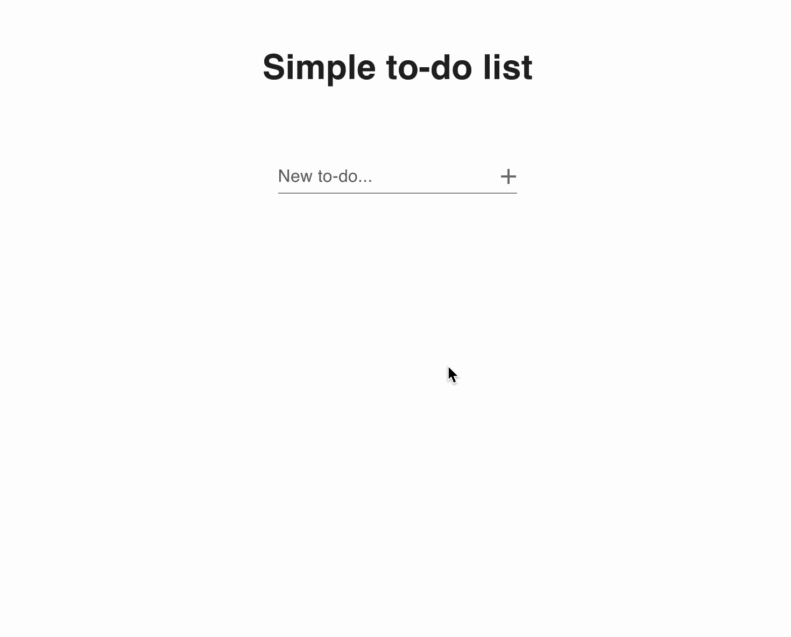

# Simple Todo List using Material UI and LocalStorage

A simple todo list web application built with React, Material UI components, and browser localStorage for data persistence.

## Demo



## Description

Simple web app todo list created using React + Vite + JavaScript. The components for the todo list were created using [Material UI](https://mui.com/). The app has persistence by making use of browser localStorage. Icons were used from the MaterialUI library.

## Features

- Add, delete, and check off todos
- Data persistence with localStorage
- Responsive design

## Tech Stack

- **React** - Frontend framework
- **Vite** - Build tool and development server
- **JavaScript** - Programming language
- **Material UI** - Component library and icons
- **localStorage** - Browser storage for data persistence

## Getting Started

### Prerequisites

- Node.js (v14 or higher)
- npm

### Installation

1. Clone the repository:
   ```bash
   git clone https://github.com/nicholastickle/react-todo-list.git
   ```

2. Navigate to the project directory:
   ```bash
   cd react-todo-list
   ```

3. Install dependencies:
   ```bash
   npm install
   ```

4. Start the development server:
   ```bash
   npm run dev
   ```

5. Open your browser and navigate to `http://localhost:5173`

## Available Scripts

- `npm run dev` - Start development server
- `npm run build` - Build for production
- `npm run preview` - Preview production build
- `npm run lint` - Run ESLint

## License

This project is licensed under the MIT License - see the [LICENSE](LICENSE) file for details.

## Author

**Nicholas Tickle**
- GitHub: [@nicholastickle](https://github.com/nicholastickle)

## Acknowledgments

- [Material UI](https://mui.com/) for the beautiful component library
- [Vite](https://vitejs.dev/) for the amazing build tool
- [React](https://reactjs.org/) for the powerful frontend framework

